=== Lightning round ===
Final submissions were almost entirely based on a simple coarse raster. Using the trick of painting each pixel by incrementally chopping and painting large rectangles reduced the production cost signifiantly. The most expensive portion is the render of the final few rows/columns, so a judicious choice of render direction and chopping off the final few rows/columns as a "bleed" area helped cut costs.

Final renders versus reference images are shown below.

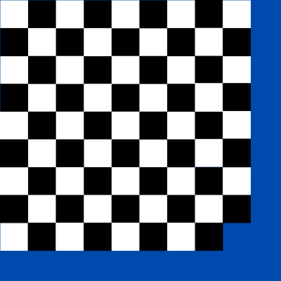 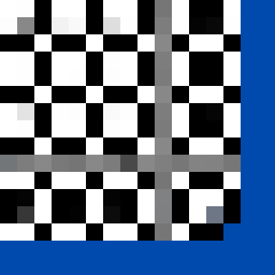

 

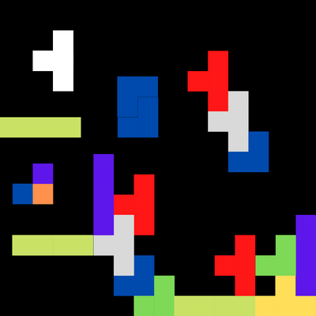 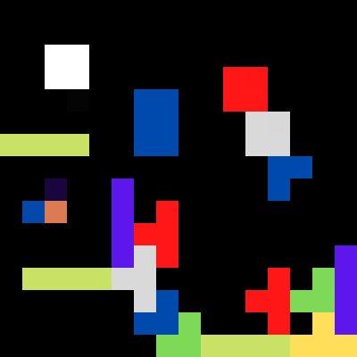

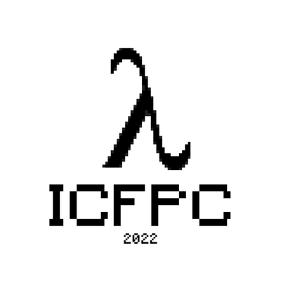 

 

 

 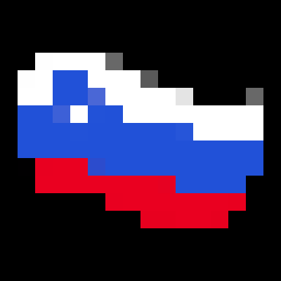

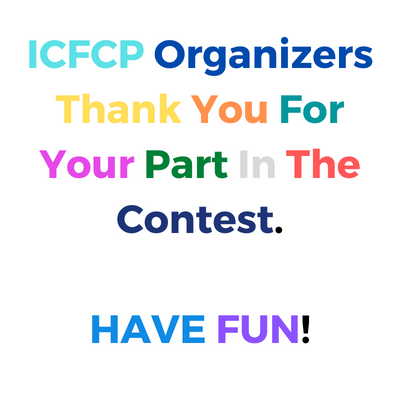 

 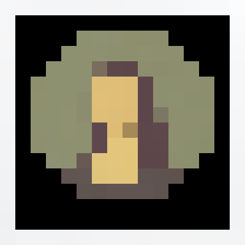

 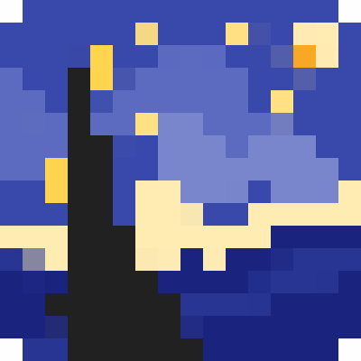

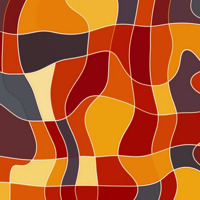 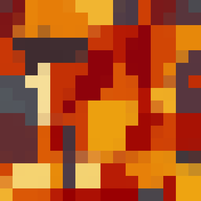

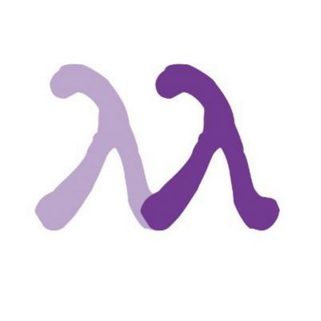 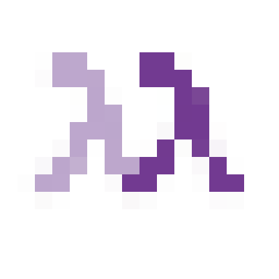

 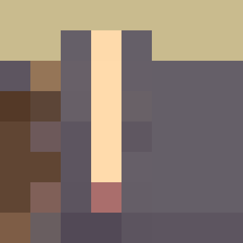

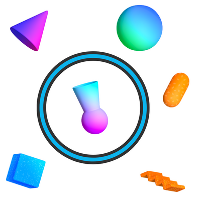 

 

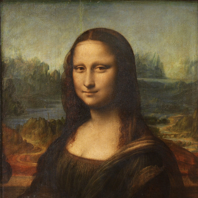 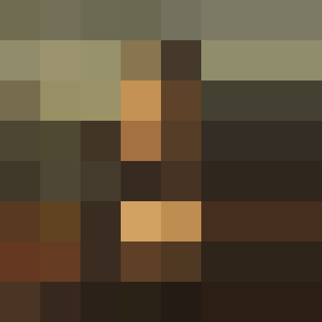

 

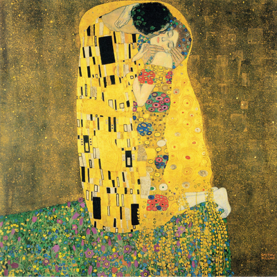 

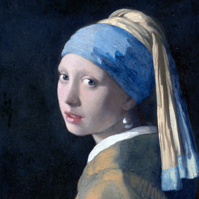 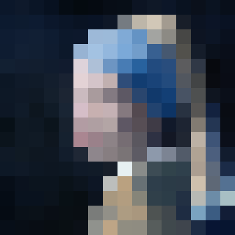

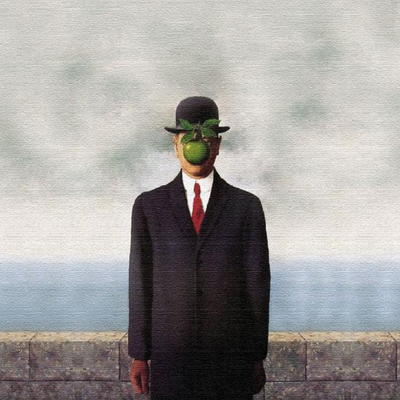 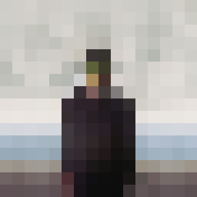

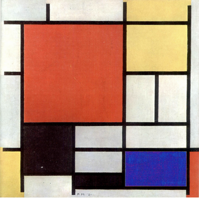 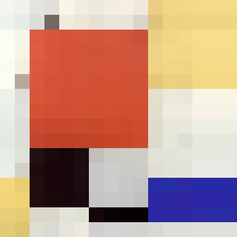

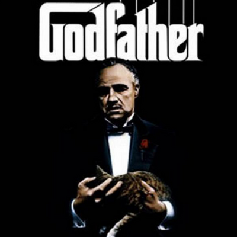 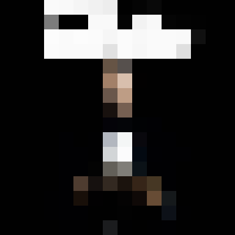

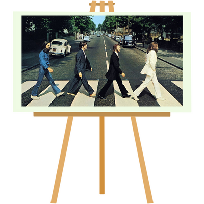 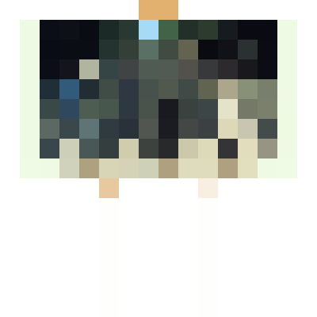

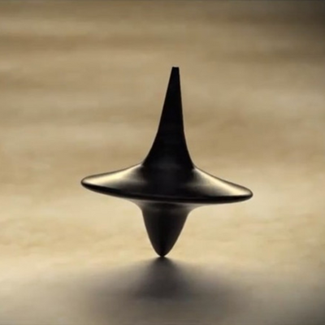 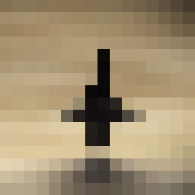

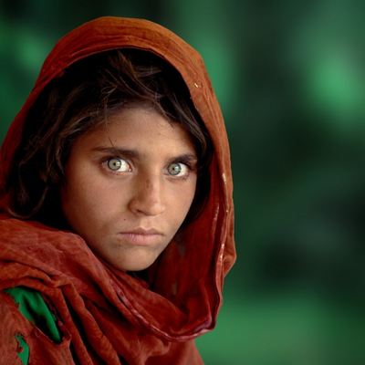 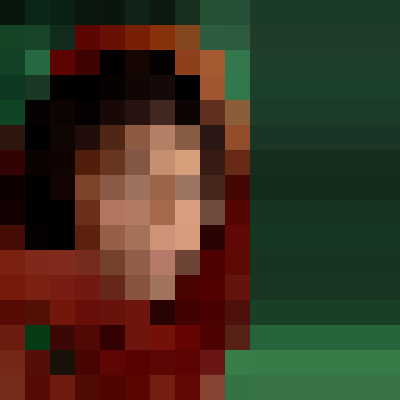
