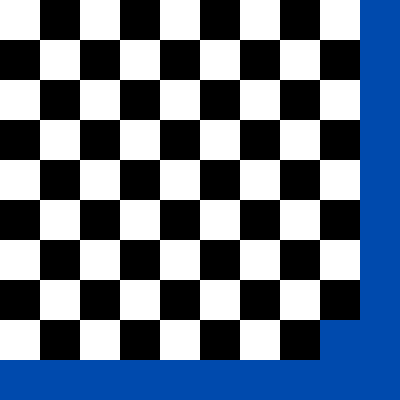

# Lightning round
Final submissions were almost entirely based on a simple coarse raster. Using the trick of painting each pixel by incrementally chopping and painting large rectangles reduced the production cost signifiantly. The most expensive portion is the render of the final few rows/columns, so a judicious choice of render direction and chopping off the final few rows/columns as a "bleed" area helped cut costs.

Our scoring for this round was:
```
1 (Chess Table): 26966
2 (RoboPainter): 9176
3 (Tetris Game): 41553
4 (ICFP Programming Contest Logo): 25308
5 (ICFP 2022 Logo): 31406
6 (Haskell Coder's View): 17310
7 (Slovenia Flag): 43365
8 (Thank You): 21906
9 (SimpLisa): 47740
10 (Starry Night): 41254
11 (Curves): 49046
12 (SIGPLAN-M): 31273
13 (Not So SimpLisa): 33902
14 (Objects Lying Around): 45199
15 (Simply Screaming): 45558
16 ("The" Mona Lisa): 29483
17 ("The" Starry Night): 40383
18 ("The" Kiss): 53202
19 ("The" Girl with a Pearl Earring): 45979
20 ("The" Son of Man): 39757
21 (Special Request): 50523
22 (Godfather): 50838
23 (Beatles): 39233
24 (Inception): 33868
25 ("The Girl"): 30175
== Total: 924403 ==
```

Final renders versus reference images are shown below.

 

 

 

 

 

 

 

 

 

 

 

 

 

 

 

 

 

 

 

 

 

 

 

 

 
